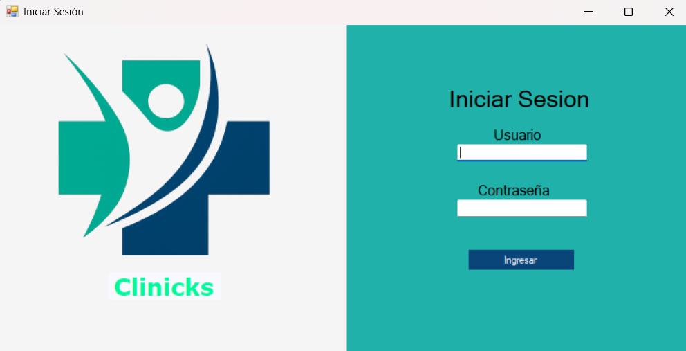
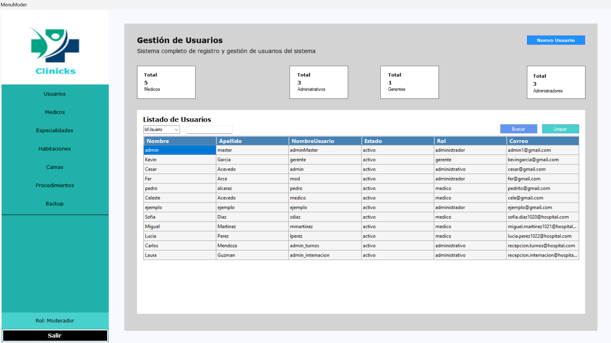
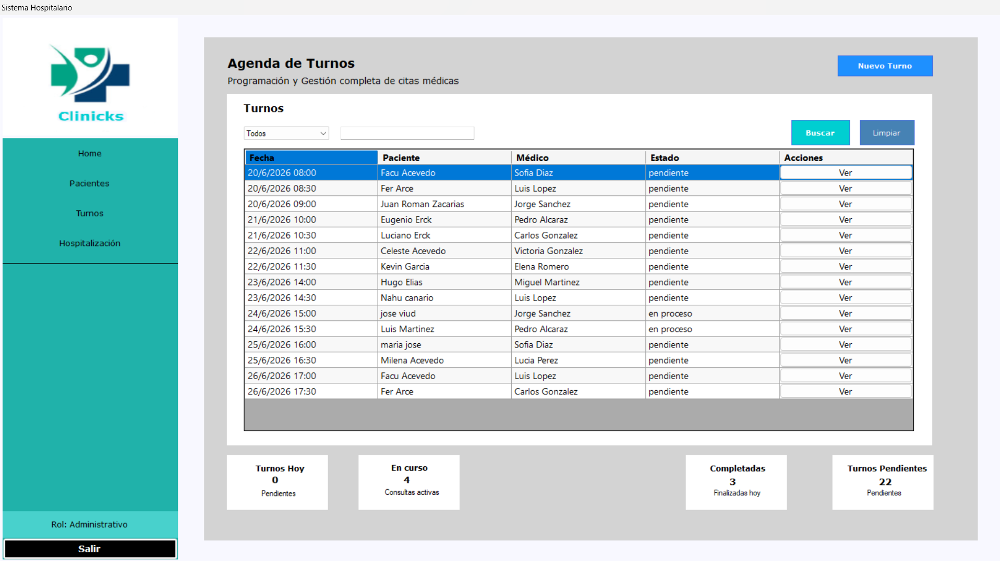
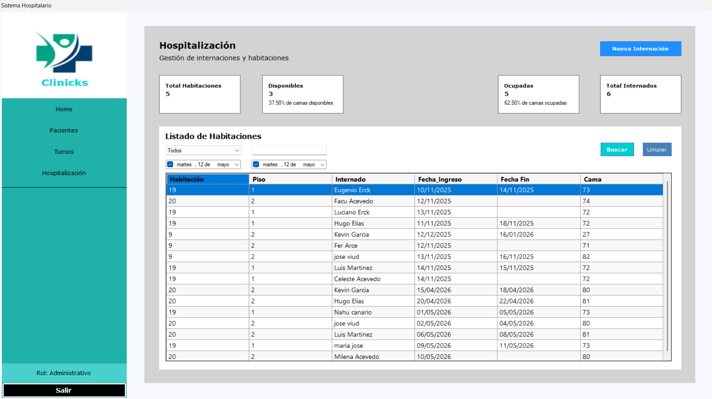
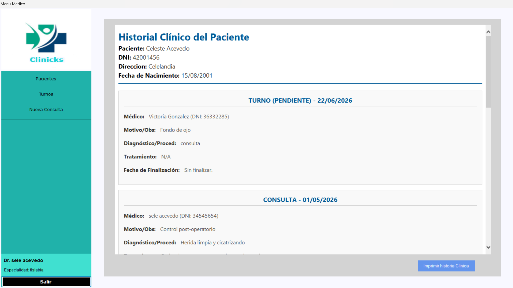
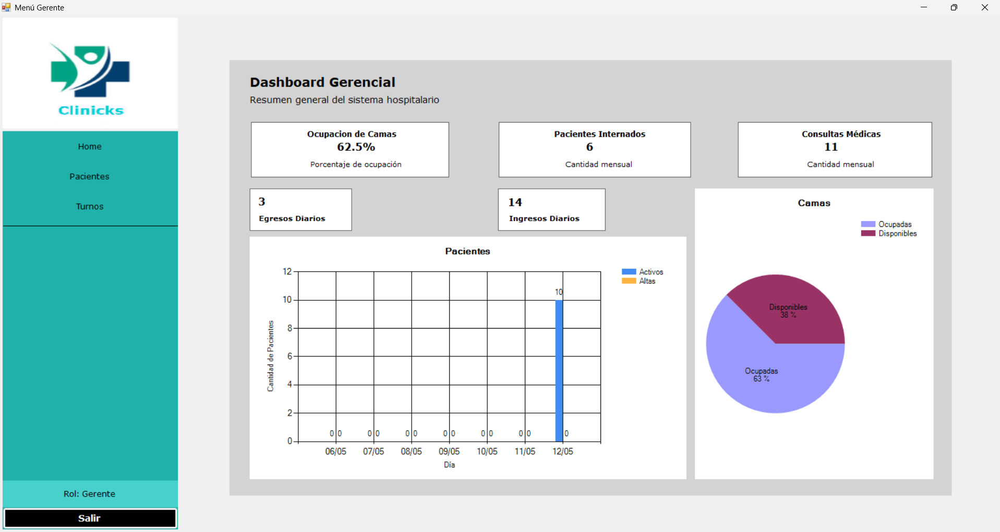
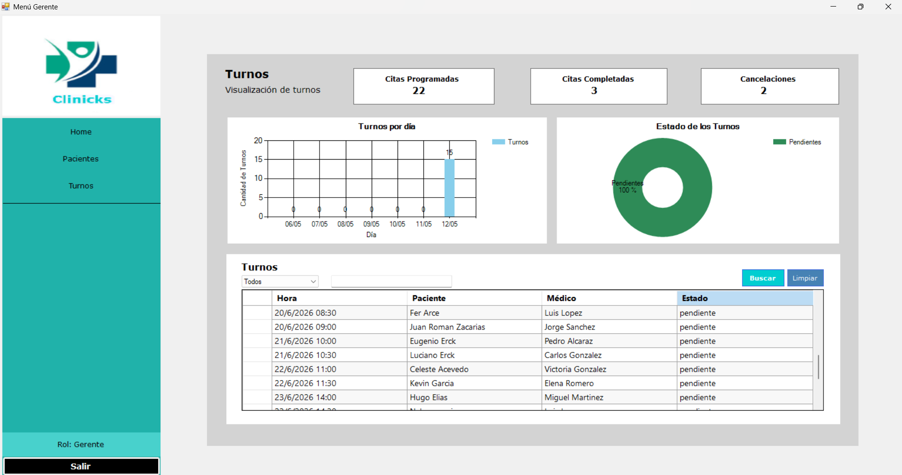

# 🏥 Sistema de Gestión Hospitalaria (N-Layer)

[](https://github.com/TFacund0/Sistema-Hospitalario/releases/tag/v1.0)

[](https://dotnet.microsoft.com/)
[](https://docs.microsoft.com/en-us/dotnet/csharp/)
[](https://www.microsoft.com/en-us/sql-server/)
[](https://opensource.org/licenses/MIT)

## 🌟 Descripción General

Este proyecto es un **Sistema Integral de Gestión Hospitalaria** desarrollado como proyecto académico para la facultad. Fue mi primer acercamiento a una **Arquitectura por Capas (N-Layer)**, diseñada para separar las responsabilidades de persistencia, lógica de negocio e interfaz de usuario.

El sistema permite gestionar todo el ciclo operativo de un hospital, desde el ingreso de pacientes y la asignación de camas hasta la visualización de estadísticas gerenciales y la seguridad de la información.

<p align="center">
  
</p>

---

## 🛠️ Arquitectura y Tecnologías

El sistema sigue el patrón de diseño de **Arquitectura en Capas**:

-   **Capa de Presentación (UI)**: Desarrollada en **Windows Forms (C#)**. Utiliza controles de usuario (UserControls) para una navegación fluida y moderna.
-   **Capa de Negocio (BLL)**: Contiene la lógica central, validaciones y orquestación de servicios. Implementa el uso de **DTOs (Data Transfer Objects)** para la comunicación segura entre capas.
-   **Capa de Datos (DAL)**: Gestión de persistencia mediante **Entity Framework (Database First)** y Repositorios.

### Tecnologías Clave:
-   **Lenguaje**: C# (.NET Framework 4.8)
-   **Persistencia**: Entity Framework 6.0
-   **Base de Datos**: Microsoft SQL Server
-   **Gráficos**: LiveCharts (para el módulo de estadísticas)
-   **Seguridad**: Hashing de contraseñas con SHA-256

---

## 📋 Módulos del Sistema

El sistema está dividido en 4 roles principales, cada uno con acceso restringido y funcionalidades específicas:

### 1. 👮 Administrador (IT/Infraestructura)
-   Gestión de usuarios y asignación de roles.
-   Administración de infraestructura (Habitaciones, Camas, Especialidades).
-   Gestión de **Backups y Restauración** de la base de datos.

<p align="center">
  
  
</p>

### 2. 📝 Administrativo (Gestión de Pacientes)
-   Registro y alta de pacientes.
-   Gestión de **Turnos Médicos** con validación de disponibilidad.
-   **Hospitalización**: Gestión de ingresos (internaciones) y altas médicas.

<p align="center">
  
  
</p>

### 3. 👨‍⚕️ Médico (Agenda Clínica)
-   Visualización de agenda diaria personalizada.
-   Atención de turnos y registro de notas médicas.
-   Cambio de estados de citas (Atendido, Pendiente, Cancelado).

<p align="center">
  
  
</p>

### 4. 📈 Gerente (Analítica de Datos)
-   Dashboard dinámico con gráficos en tiempo real.
-   Estadísticas de ocupación de camas.
-   Reportes de afluencia de pacientes y efectividad de turnos.

<p align="center">
  
  
</p>

---

## 🚀 Instalación y Configuración

1.  **Clonar el repositorio**:
    ```bash
    git clone https://github.com/TFacund0/Sistema-Hospitalario.git
    ```
2.  **Base de Datos**:
    -   Importar el backup ubicado en `/database/Database-Backup/` en SQL Server.
    -   Actualizar la cadena de conexión en el archivo `App.config` de la **Capa de Presentación**.
3.  **Compilación**:
    -   Abrir `Sistema Hospitalario.sln` en Visual Studio (2019 o superior).
    -   Restaurar paquetes NuGet.
    -   Ejecutar el proyecto.

---

## 💡 Aprendizajes y Evolución

Este proyecto representa un hito importante en mi formación como desarrollador:
-   **Primera implementación de N-Layer**: Aprendí a separar responsabilidades para lograr un código más mantenible.
-   **Manejo de Transacciones**: Gestión de cambios concurrentes en pacientes, camas e internaciones.
-   **Documentación Profesional**: Implementación de comentarios XML para soporte de IntelliSense.

> [!NOTE]
> Aunque este proyecto fue desarrollado durante mis inicios con arquitecturas complejas, hoy en día aplico patrones más avanzados como **Interfaces (IoC)**, **Inyección de Dependencias**, **JWT** para seguridad y **Clean Architecture**.

---

## 📄 Licencia

Este proyecto está bajo la Licencia MIT. Consulta el archivo [LICENSE](LICENSE) para más detalles.

---
*Desarrollado para el Taller de Programación II - 
Facultad de Ciencias Exactas y Naturales y Agrimensura (Universidad Nacional del Nordeste - UNNE).*.